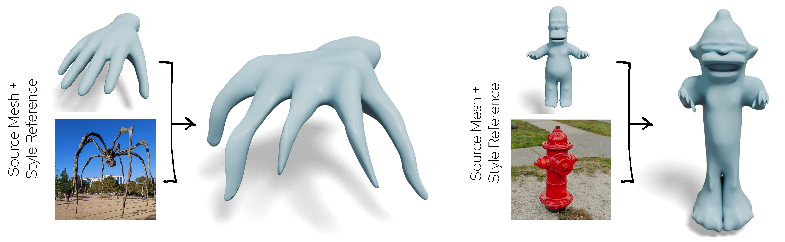

<div align="center">

# Image-Guided Geometric Stylization of 3D Meshes (CVPR 2026)

[](https://changwoonchoi.github.io/GeoStyle/)
[](https://arxiv.org/abs/2604.07795)

**[Changwoon Choi](https://www.changwoon.info/)**\* · **[Hyunsoo Lee](https://hleephilip.github.io/)**\* · **[Clément Jambon](https://clementjambon.github.io/)** · **[Yael Vinker](https://yael-vinker.github.io/website/)** · **[Young Min Kim](https://3d.snu.ac.kr/members/)**

(\* Equal Contribution)

</div>

<br/>



## 📋 Requirements
* **OS:** Ubuntu 20.04 or higher
* **GPU:** An NVIDIA GPU [compatible](https://docs.nvidia.com/deploy/cuda-compatibility/) with CUDA 11.8
* **Environment:** Miniconda or Anaconda to manage Python virtual environments
* **Compiler:** GCC 8 or higher

## 🚀 Instructions
Instructions are provided in separate files:
* [Installation](docs/installation.md)
* [Running the Code](docs/codebase.md)

## 🙏 Acknowledgements

This implementation is based on the following works:

* [TextDeformer](https://github.com/threedle/TextDeformer)
* [nvdiffrast](https://github.com/NVlabs/nvdiffrast)
* [nvdiffrec](https://github.com/NVlabs/nvdiffrec)
* [PartField](https://github.com/nv-tlabs/PartField)
* [diffusers](https://github.com/huggingface/diffusers)

We sincerely thank the authors for publicly sharing their repositories.

## 🎓 Citation

```bibtex
@InProceedings{Choi_2026_CVPR,
    author    = {Choi, Changwoon and Lee, Hyunsoo and Jambon, Cl\'ement and Vinker, Yael and Kim, Young Min},
    title     = {Image-Guided Geometric Stylization of 3D Meshes},
    booktitle = {Proceedings of the IEEE/CVF Conference on Computer Vision and Pattern Recognition (CVPR)},
    month     = {June},
    year      = {2026},
    pages     = {19972-19981}
}
```

